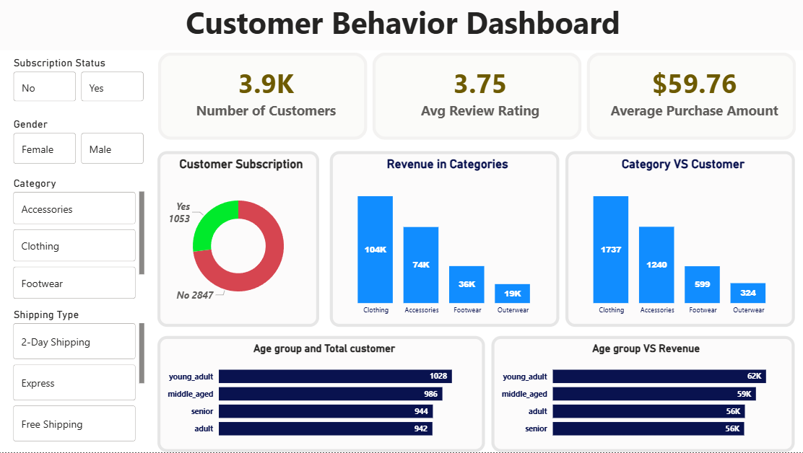

# Consumer Shopping Behavior Analysis

## Overview

This project analyzes consumer shopping behavior data to uncover trends, identify purchase drivers, and generate actionable business insights. The goal is to help retail businesses improve customer engagement, optimize marketing strategies, and enhance product performance through data-driven decision-making.

## Problem Statement

A retail company wants to better understand customer purchasing behavior across demographics, product categories, and sales channels. By analyzing historical shopping data, this project answers the following business question:

> How can the company leverage consumer shopping data to identify trends, improve customer engagement, and optimize marketing and product strategies?

---

## Dataset

- **~3,900 customer records**
- **15+ features**
- Each row represents a unique customer purchase behavior
- Included demographic, purchasing, subscription, review, discount, and transaction-related information

### Data Quality

- Identified and handled missing values during preprocessing
- Performed data cleaning, transformation, and feature engineering
- Prepared analysis-ready datasets for downstream SQL analysis and dashboard development

---

## Tech Stack

### Data Processing

- Python
- Pandas
- NumPy

### Database

- PostgreSQL
- SQL

### Visualization

- Power BI

---

## Dashboard Preview

## Project Workflow

---

### 1. Data Preparation

- Data cleaning
- Missing value handling
- Data transformation
- Feature engineering

### 2. Database Integration

- Migrated processed data into PostgreSQL
- Designed structured tables for analysis

### 3. Business Analysis

Performed SQL-based analysis to answer key business questions related to:

- Revenue contribution
- Customer segmentation
- Product performance
- Discount effectiveness
- Subscription behavior
- Purchase trends

### 4. Dashboard Development

Built an interactive Power BI dashboard to visualize:

- Customer demographics
- Revenue trends
- Product insights
- Customer loyalty metrics
- Purchase behavior patterns

---

## Key Insights

### Revenue by Gender

- Male customers generated significantly higher revenue than female customers.

### Subscription Analysis

- Subscriber and non-subscriber average spending was similar.
- Non-subscribers contributed a larger share of total revenue due to higher customer volume.

### Customer Loyalty

- Loyal customers represented the majority of the customer base.
- Repeat buyers showed strong engagement with the platform.

### Product Performance

- Gloves, Sandals, and Boots received the highest average review ratings.
- Jewelry and Blouses were among the most frequently purchased products.

### Discount Effectiveness

- Certain products showed nearly 50% discount adoption rates, indicating strong customer responsiveness to promotions.

### Age Group Contribution

- Young adults generated the highest overall revenue contribution.

---

## Business Questions Answered

1. Revenue comparison by gender
2. High-spending customers using discounts
3. Highest-rated products
4. Shipping type spending comparison
5. Subscriber vs non-subscriber spending behavior
6. Products with highest discount adoption
7. Customer segmentation (New, Returning, Loyal)
8. Top-selling products by category
9. Subscription likelihood among repeat buyers
10. Revenue contribution by age group

---

## Outcome

This project demonstrates an end-to-end analytics workflow involving data preprocessing, database management, SQL-based business analysis, and dashboard visualization. The resulting insights can support retail decision-making in customer retention, marketing optimization, and product strategy.

---

**Tools Used:** Python • Pandas • NumPy • PostgreSQL • SQL • Power BI
